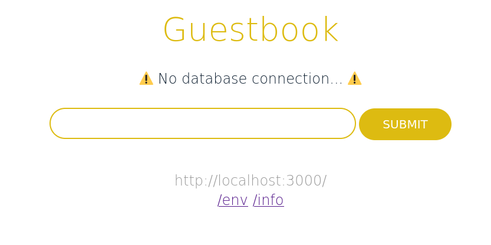
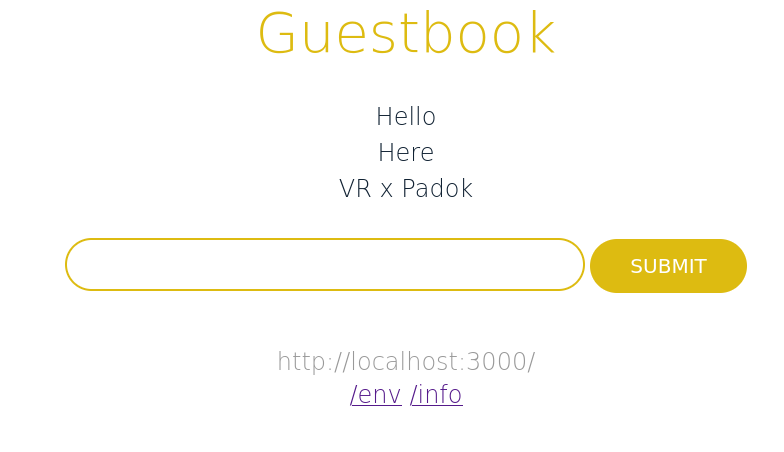

# GuestBook Kubernetes Dojo

Welcome to this Kubernetes Dojo!
Your goal is to deploy a simple web application in a Kubernetes cluster, and learn the maximum during this session.

That's why it is essential that:

- You experiment and try things that may break. Don't simply copy paste everything from StackOverflow until it passes the test !
- But also keep focus on your goal: have a working application, piece by piece. Don't block at the start for a detail.
- To keep moving or learn more, please _andon_! It means then whenever you have a question, a doubt, a feedback, call someone from the staff, we'll love to help you.

## 0. Setup your env

### Connect to a distant VM

To work efficiently, you will work on a distant VM on which this repository is already cloned and all the following tools are already installed.

- `git`: Version your code and collaborate
- [`docker`](https://docs.docker.com/get-docker/): Build and run container images
- [`docker-compose`](https://docs.docker.com/compose/install/#install-compose): Run multiple containers locally
- [`kubectl`](https://kubernetes.io/docs/tasks/tools/#kubectl): The CLI to interact with Kubernetes
- [`helm`](https://helm.sh/docs/intro/install/): Generate Kubernetes manifest from templates and manage their deployment
- [`kind`](https://kind.sigs.k8s.io/docs/user/quick-start/#installation): Create a Kubernetes locally inside containers

To connect to the VM:

- Go to https://\<handleGithub\>.training.padok.school
- The password is `<handleGithub>12345`

<details>
<summary>💡 Tip N˚1</summary>

Once in VSCode to see this document in a more human friendly way press `crtl+shift+v` or `cmd+shift+v` for mac os

</details>

<details>
<summary>If you have your own VSCode configured and your github account as a ssh key configure. You can connect through ssh.</summary>

- Add the following [Remote SSH extension](https://code.visualstudio.com/docs/remote/ssh) to VSCode
- Create a github account
- Create a SSH key on your Github account: [Add a ssh key documentation](https://docs.github.com/en/authentication/connecting-to-github-with-ssh/generating-a-new-ssh-key-and-adding-it-to-the-ssh-agent)
- Share your Github handle with Padok's team member

- Launch a "Remote SSH Session" with VSCode extension via the command `ssh <handleGithub>@<handleGithub>.ssh.padok.school`

</details>

### Setup a Kubernetes cluster on your VM

We have a script ready for you, it uses the `kind-cluster.yaml` config in this repo for the cluster configuration. If you need more nodes, you'll need to modify it.

It also installs an _Ingress Controller_, which acts as a reverse proxy for your cluster.

```bash
cd dojo-guestbook
./scripts/bootstrap.sh

# At the end of the workshop to delete the cluster
# ./scripts/teardown.sh
```

You should be able to run some `kubectl` queries automatically:

```bash
$ kubectl get nodes
NAME                           STATUS   ROLES                  AGE     VERSION
padok-training-control-plane   Ready    control-plane,master   3m29s   v1.22.5
$ kubectl get pods
No resources found in default namespace.
```

To test that your cluster is working, you can query the _Nginx Ingress Controller_, which should respond with a 404 since no app is declared behind. \
You can visit https://\<handleGithub\>.training.padok.school/proxy/80 OR

```bash
curl guestbook.lvh.me
<html>
<head><title>404 Not Found</title></head>
<body>
<center><h1>404 Not Found</h1></center>
<hr><center>nginx</center>
</body>
</html>
```

### Checks (before you go on)

- [ ] I can run a simple command with all the tool listed above (`git --version`, `kubectl --help`, etc...)
- [ ] I can run a container: `docker run hello-world`
- [ ] I can run a simple `kubectl` query: `kubectl get nodes`
- [ ] I can contact my cluster through http/https: https://\<handleGithub\>.training.padok.school/proxy/80 returns a 404

## 1. (Optional) Build and launch the app locally

> This task is optional, don't lose time on it right now!

### Why

If you truly want to immerse yourself in the life of a developer, you will need to be able to iterate quickly on the app locally.

### What

Be creative, try to modify a simple thing in the app.

### How

For this you simply need the `go` cli installed and some knownledge of this language.

To install the `go` cli:
```bash
sudo apt-get -y install golang-go
```

When you are happy with the result, you can launch the app with `sudo go run main.go`, or build a binary with `sudo go build`.

### Checks

- [ ] I can run the app locally, and see the web UI.
- [ ] I have implemented a small change in the application and it still runs

<details>
<summary>🔍 Hint N˚1</summary>

Your app is running on the port 3000

</details>

<details>
<summary>🔍 Hint N˚2</summary>

You can see it on https://\<handleGithub\>.training.padok.school/proxy/3000

</details>

## 2. Build a container image (Docker)

### Why

While you build and iterate on your app locally, you need to be able to deploy it on a real production environment.

Since you don't know where it will run (in an isolated virtual machine?, which packages are installed?), we want to ensure the reproductability and isolation of the application. That's what containers, that `docker` helps build and run, are made for!

It is a standard API to build and ship applications across diverse workloads. Whatever the server it is running on, your _image_ should always construct the same isolated environment.

Moreover, it is way less expensive in resources (CPU, RAM) than a Virtual Machine, which achieves an isolation by reinstalling a whole OS.

### What

We need to _build_ a container _image_ from the code in this repository. For this, the command `docker build -t <image-name>:<version> .` builds an image from a local _recipe_ `Dockerfile`.

For example, for a simple python application, it could be:

```Dockerfile
FROM python:3.8

COPY requirements.txt .
RUN pip install -r requirements.txt

COPY main.py main.py

CMD ["python", "main.py"]
```

You can find the complete [Dockerfile reference](https://docs.docker.com/engine/reference/builder/) here.

Here we have a _webservice_ written in _golang_, running an HTTP server on the port `3000`.
It serves some static files (stored in `/public`) for the UI. You will mainly access it through a `GET /` for the UI, but there are other routes to manage the state of the app.

### How

You can follow [this tutorial](https://docs.docker.com/language/golang/build-images/) to see how to build a golang image

1. Write a `Dockerfile`. You need to start from a _base image_, ideally with golang already installed.
2. Define a working directory.
3. In the `Dockerfile`, download the microservice's dependencies using the `go mod download` command. Since latest golang versions, we only need `go.mod` and `go.sum` for this task.
4. In the `Dockerfile`, build the microservice. You need the `go build` command for this.
5. In the `Dockerfile`, add the `public` folder inside the container, in the same `public` folder.

   ```Dockerfile
   COPY ./public public
   ```

6. When the container starts, run the microservice.
7. Build a container image: `docker build -t guestbook:v0.1.0 .`
8. Run the container.

   You need to _expose_ the port of your application, which runs on port `3000`. For this, you need to add the `--publish <external-port>:<internal-port>` to the `docker run` command.

   ```bash
   docker run --publish 3000:3000 guestbook:v0.1.0
   ```

9. Check that the microservice responds to requests on
   `http://<handleGithub>.training.padok.school/proxy/3000`. You should see the following UI:

   

10. **Optional**: Implement some best practices, such as "multi-stage builds". It helps reduce the size of your images and increase security.

    The image you built so far is pretty large because it contains the entire Go
    toolkit. It's time to make it smaller. Much smaller. Here is what you need to
    do:

    1. Check to see how big your container image is.
    2. Change the `go build` command to make the binary statically linked (if you
    don't know what that means, just ask!). You might need to add a `go mod tidy` command.
    3. In your `Dockerfile`, create a second stage that starts from `scratch`.
    4. Copy the binary from the first stage to the second.
    5. In the second stage, run the microservice.
    6. Build your container image again.
    7. Check to see how big the image is now.

### Checks

- [ ] I can build an image locally
- [ ] I can run a the container locally
- [ ] I can access the web interface locally

<details>
<summary><em>Compare your work to the solution before moving on. Are there differences? Is your approach better or worse? Why?</em></summary>

You can find the solution for the single-stage build [here](solution/Dockerfile) or [here](solution/Dockerfile-multistage) for the multi-stage build. Don't spoil yourself too much!

</details>

## 3. Run it locally with docker compose

### Why

You have a working local environment, however you already need to chain a few commands, and as your app will be growing more complex, the setup will be harder to maintain.

Instead of having to type an _imperative_ chain of commands, you can have a _declarative_ description of your local _docker/container_ application. That's is why `docker compose` is made for: it reads this config and runs the right `docker commands` for you.

### What

We need to be able to launch the current container with only the `docker compose up` command.

The `docker-compose.yaml` file will contain everything needed:

- how to build the image
- how to run the container, including port configuration
- how to link it to another container
- how to persist a storage

### How

There is a [_get started_](https://docs.docker.com/compose/gettingstarted/) article, or the [complete specification](https://docs.docker.com/compose/compose-file/)

- define your guestbook service
- you can use the image you built, but you can also specify how to rebuild it!
- don't forget to expose the port needed for your application

### Checks

- [ ] I can launch locally the application with `docker compose up`
- [ ] I can see the UI in my brower at `http://<handleGithub>.training.padok.school/proxy/3000`

<details>
<summary>Compare your work to the solution before moving on. Are there differences? Is your approach better or worse? Why?</summary>

You should have something like:

```yaml
version: '3'
services:
  guestbook:
    build:
      context: ./
      dockerfile: Dockerfile
    ports:
    - 3000:3000
```

</details>


## 4. Add a database to your service

### Why

If you test your app, you can see a big **⚠️ No database connection... ⚠️**. Furthermore, when you try to add something to the guestbook, it hangs (⌛) without saving it (try to refresh the page).

The application is actually stateless, and needs a Redis backend to save its state. To avoid interfering with your local installation, we will run it in container, using once again `docker` and `docker compose`.

### What

We simply need to add a new service in our docker-compose file, and have a way for the app to use it.

### How

1. Add a `redis` service in your app. Don't build redis locally, but use the public `redis:7` image.
2. Expose its redis port `6379`.
3. Make the guestbook app use it:

   The Guestbook app uses _environment variable_ for its configuration. Here you need to setup the `REDIS_HOST` variable to the hostname of your redis cluster. In a docker-compose environment, each service can be called with its name.
4. Try to run it: does the application store the state?
5. (Optional) Make it persistent!

   Currently, if you save some sentences in the app, then run `docker compose down` and `docker compose up` again, you'll see that you will loose all your data! 😢

   You can manage volumes in docker-compose, which are persisted, and mount these volumes in your app. If you prefer, you can also link a local folder to a container, it can be useful for live reloading.

### Check

- [ ] The application actually saves messages

   

- [ ] (Optional) If you run `docker compose down`, you don't loose data when you relaunch the app.

<details>
<summary><em>Compare your work to the solution before moving on. Are there differences? Is your approach better or worse? Why?</em></summary>

You can find the complete solution [here](solution/docker-compose.yaml). Don't spoil yourself too much!

</details>

## 5. Deploy your app on Kubernetes: the Pod

> If you are here before the presentation on Kubernetes, you can wait for it by helping others catch up! We will make a quick explanation for everyone!

### Why

Now that we can run our application locally, we want to take it a step further: we will recreate everything we have done using Docker Compose, in Kubernetes using manifests and Helm charts!

### What

We will start with the basics: a Pod. It is the basic unit to run something on Kubernetes. It is composed of one or several containers, running together.

Here is an example of a Pod manifest:

```yaml
apiVersion: v1
kind: Pod
metadata:
  name: my-pod
  namespace: my-namespace
  labels:
    foo: bar
spec:
  containers:
    - name: my-container
      image: myapp:v1.0.0
      command: ['/bin/my-app']
      args: ['--migrate-db', '--db-host=12.34.56.78']
```

You can save this kind of _manifest_ into a file, for example `manifests/pod.yaml`, and then _deploy it_ to Kubernetes with `kubectl apply -f manifests/pod.yaml`. If you have several files, you can also apply the whole folder.

You also have some basic Kubernetes commands to get informations about your pod.

```bash
kubectl get pods
kubectl describe pod <my-pod>
kubectl logs <my-pod>
```

Take some time to [learn a bit about pods](https://kubernetes.io/docs/concepts/workloads/pods/pod/).

### How

1. Write a `pod.yaml` file (the VSCode extension can help you with that)
2. At minimum, you need a name and a first container definition, with its name and image. For the image, you can push the image to a public registry, or for *kind* add it to the cluster with `kind load docker-image "${IMAGE}" --name padok-training`. You can also use the following: `dixneuf19/guestbook:v0.1.0`.
3. Try to deploy it, and launch the previous command
4. If you need to delete it, use `kubectl delete -f manifests/`
5. Take some time to play around with this object: what happens if you give a non existing image?
6. Try to access your application with `kubectl port-forward <my-pod> 3000:3000 --address 0.0.0.0`

### Checks

- [ ] My pod is running: I can see its state and follow its logs
- [ ] I have access to the Web UI with the port-forward

<details>
<summary>Compare your work to the solution before moving on. Are there differences? Is your approach better or worse? Why?</summary>

You should have something like:

```yaml
apiVersion: v1
kind: Pod
metadata:
  name: guestbook
  labels:
    app: guestbook
    project: dojo
spec:
  containers:
  - name: guestbook
    image: dixneuf19/guestbook:v0.1.0
    ports:
    - containerPort: 3000
      name: http
```
</details>


## 6. Manage replications and rolling update: Deployments

### Why

One pod is cool, but what if you want to deploy several instances of the same app, to avoid any downtime if a node fails?

That is the function of deployments: you declare a _template of a Pod_, with also a replication. It also helps you manage updates of your applications without any downtime.

### What

Same as before, everything in Kubernetes is declarative. You can create a file, write a manifest into it and apply!

```yaml
apiVersion: apps/v1
kind: Deployment
metadata:
  name: my-deployment
spec:
  replicas: 3
  selector:
    matchLabels:
      foo: bar
  template:
    metadata:
      labels:
        foo: bar
    spec:
      containers:
        - name: my-container
          image: myapp:v1.0.0
          ports:
            - containerPort: 3000
```
As for all kubernetes resources, here are generic useful commands:

```bash
kubectl get deployment
kubectl describe deployment <my-dep>
```

### How

1. Transform your current pod into a deployment. You need to put everything from `Pod.spec` to the `Deployment.spec.template.spec`.
2. What are these "selector"? Can you modify them?
3. Play along with replicas. Try to delete some pods.
4. Modify something in your template, and watch closely the way your pods are replaced. Is there any _downtime_?

### Checks

- [ ] I can still access one of my replicas with port-forward
- [ ] I have listed or described my deployment

<details>
<summary>Compare your work to the solution before moving on. Are there differences? Is your approach better or worse? Why?</summary>

```yaml
apiVersion: apps/v1
kind: Deployment
metadata:
  name: guestbook
spec:
  replicas: 3
  selector:
    matchLabels:
      app: guestbook
      project: dojo
  template:
    metadata:
      labels:
        app: guestbook
        project: dojo
    spec:
      containers:
      - name: guestbook
        image: dixneuf19/guestbook:v0.1.0
        ports:
        - containerPort: 3000
          name: http
```
</details>


## 7. Expose your app internally

### Why

While you can access your app with port-forwarding, it is not very convenient. Moreover, since the app is _stateless_, we want to access any pod.

For a start, an internal access would be good enough. That is the job of *Services*, they provide an internal load balancing inside the cluster.

### What

You start to know the drill: create a manifest and apply it.

Note that for services, you need to _select_ your pods using their **labels**. The easy thing to do: just use the same labels used in your deployment to find its pods.

```yaml
apiVersion: v1
kind: Service
metadata:
  name: my-service
spec:
  selector:
    foo: bar
  ports:
    - protocol: TCP
      port: 80
      targetPort: 8080
```

In the cluster, other pods will be able to call one of the pods behind the service, just with

```bash
curl http://my-service # request one of the pods selected by the service
# if your pod runs in a different namespace, you need to specify it
curl http://my-service.my-ns
```

Here is the [official documentation](https://kubernetes.io/docs/concepts/services-networking/service/#defining-a-service) and some useful commands.

```bash
kubectl get services
kubectl describe service <my-svc>
kubectl port forward svc/<my-svc> 3000:80
# lets see on http://<handleGithub>.training.padok.school/proxy/3000
```

### How

1. Create the service manifest, set the correct labels and port and apply it!
2. You are free to use the external port you want
3. You can test if the service is functional with `kubectl port-forward svc/<my-svc> <local-port>:<svc-port> --address 0.0.0.0`
4. Try to break your service: what happens if you set wrong labels? Can you have a service pointing to multiple deployments?

### Checks

- [ ] I can access the UI using port-forwarding on the service

<details>
<summary><em>Compare your work to the solution before moving on. Are there differences? Is your approach better or worse? Why?</em></summary>

You can find the complete solution [here](solution/manifests/service.yaml). Don't spoil yourself too much!

</details>

## 8. Show it to the world: Ingress

### Why

Now that you have an internal load balancer, you want to expose your app to your friends. Thankfully, an **Ingress Controller** and its DNS are already setup for you, all traffic for `*.lvh.me` goes to your cluster

However, you need to tell the Ingress Controller where to route the request it receives, depending on its _hostname_ or _path_. That is the job of the **Ingress**: it defines a route to the service you deployed before.

### What

Create the manifest for an ingress and deploy it! The manifest looks like this

```yaml
apiVersion: networking.k8s.io/v1
kind: Ingress
metadata:
  name: my-ingress
  annotations:
    nginx.ingress.kubernetes.io/rewrite-target: /
spec:
  rules:
    - host: www.padok.fr
      http:
        paths:
          - path: /blog
            pathType: Prefix
            backend:
              service:
                name: my-service
                port:
                  number: 80
```

Here is the [usual documentation](https://kubernetes.io/docs/concepts/services-networking/ingress/) and commands:

```bash
kubectl get ingress
kubectl describe ingress <my-ingress>
# visit https://\<handleGithub\>.training.padok.school/proxy/80
```

### How

1. Write a manifest and apply it. Choose a specific hostname for your app and your namespace if you share the cluster
2. Try to access your app, do you have HTTPS?
3. Try to deploy your app on a _subdomain_ or on a _subpath_ using the `nginx.ingress.kubernetes.io/rewrite-target: /` annotation and modifying the `path` and `host`.

### Checks

- [ ] I can access the app from my navigator without a port forwarding

<details>
<summary><em>Compare your work to the solution before moving on. Are there differences? Is your approach better or worse? Why?</em></summary>

You can find the complete solution [here](solution/manifests/ingress.yaml). Don't spoil yourself too much!

</details>

## 9. Make it fail: probes

### Why

Our app is deployed, but is not very functional: we lack the redis for the storage! However, before deploying it, let's make it explicit that is does not work. When the redis is not set, the app should be failing. That way, someone can get the alert and fix the issue.

That is the job of *Kubernetes probes*: often doing an HTTP request, it asks continuously the application if it is still running.

### What

This time we need to modify the manifest of our deployment! Read [this article from Padok blog](https://www.padok.fr/en/blog/kubernetes-probes) or [documentation](https://kubernetes.io/docs/tasks/configure-pod-container/configure-liveness-readiness-startup-probes/) to learn how to set them.

Our app exposes its status at `/healthz`, if the application is not functional it will return a 5XX error.

### How

1. Modify your deployment and add probes to your main container. Which type of probes do you need?
2. Apply it. Is your application still available on the URL? It should not be, but rolling updates protections keep it available. Ask a teacher about it.
3. Remove the "zombie" pods. You can delete and apply back the deployment, but a more elegant solution is to _scale down_ the replica set under the deployment (`kubectl scale deployment <my-deploy> --replicas 0`).
4. Is your website still available? Does the [HTTP error code](https://developer.mozilla.org/en-US/docs/Web/HTTP/Status) make sense?

### Checks

- [ ] All my pods are "Failing" or not "Ready"
- [ ] The website is down

<details>
<summary>Compare your work to the solution before moving on. Are there differences? Is your approach better or worse? Why?</summary>

```yaml
apiVersion: apps/v1
kind: Deployment
metadata:
  name: guestbook
spec:
  replicas: 3
  selector:
    matchLabels:
      app: guestbook
      project: dojo
  template:
    metadata:
      labels:
        app: guestbook
        project: dojo
    spec:
      containers:
      - name: guestbook
        image: dixneuf19/guestbook:v0.1.0
        ports:
        - containerPort: 3000
          name: http
        readinessProbe:
          httpGet:
            path: "/healthz"
            port: http
        livenessProbe:
          httpGet:
            path: "/healthz"
            port: http
```
</details>


## 10. Install a complex Redis app with Helm

### Why

We want to fix our app and give it some persistent storage. However, Redis is a stateful application, a bit more complex than our simple webservice. We could write our own manifests for its deployment, but we would certainly make some mistakes. Let's use what the community offers us!

[Helm](https://helm.sh/) is a tool that helps us

- Generate manifests from YAML templates. You can reduce the boilerplate of your code, reduce repetition etc...
- Manage our deployments as "packages", and distribute or use remote packages made by the community.

### What

The [Helm documentation](https://helm.sh/docs/intro/quickstart/) is quite good, but unless you have time, don't lose too much time on it.

We will only need one command, which installs or upgrades a _release_ (ie a deployment package). We will use the _redis_ chart from the _bitnami_ repository, identified by its URL. Lastly, we will set one specific option, using a `values.yaml` file.

```bash
helm upgrade --install <release-name> <chart-name> --repo <repo-url> -f <path-of-values-file>
```

### How

1. We will use the _Bitnami_ Redis chart, you can find its [source code here](https://github.com/bitnami/charts/tree/master/bitnami/redis).
2. Create your `values.yaml` file. You only need to set `architecture: standalone` and disable the authentication, but you can explore other options in the `values.yaml` of the repository.
3. Deploy your release with the `helm` command:
   - You can name your release as you want, but if you name it the same name as the chart, the name of the resources will be shorter.
   - The chart you want to use is called redis
   - The Helm repository URL is https://charts.bitnami.com/bitnami
   - Don't forget to set your values file
4. Explore what has been created: pods, deployments (why is there none ?), services, etc...

### Checks

- [ ] I have 1 redis pod running
- [ ] I have one helm release deployed: `helm ls`

<details>
<summary><em>Compare your work to the solution before moving on. Are there differences? Is your approach better or worse? Why?</em></summary>

Simple run:

```bash
helm upgrade --install redis redis --repo https://charts.bitnami.com/bitnami --set architecture=standalone --set auth.enabled=false
```

You can see the complete solution [here](solution/helm/)

</details>

## 11. Connect the app to Redis

### Why

Well, you absolutely want to have a guestbook for yourself no?

### What

Your application uses an Environment Variable to set the host to the Redis server, as you have done previously in the Docker-Compose file.

The [official documentation](https://kubernetes.io/docs/tasks/inject-data-application/define-environment-variable-container/) is very clear! You need to find the path to your Redis. Since it is an internal call, you need to use the *Service* created by the Helm chart.

Once it is set correctly, your app should be _Ready_ and you should be able to access it from its public URL.

### How

1. Find the name of your Redis service. How should it be called from the pod?
2. Update your Deployment manifest and apply it.
3. Enjoy your application!

### Checks

- [ ] My pods are up and running
- [ ] I can actually use the guestbook from its public URL

<details>
<summary><em>Compare your work to the solution before moving on. Are there differences? Is your approach better or worse? Why?</em></summary>

You can find the complete solution [here](solution/manifests/deployment.yaml). Don't spoil yourself too much!

</details>

## 12. To go further

This dojo is already quite long, but here are some ideas to continue the exercise and learn more about Kubernetes! Ask your teacher for more details on where to start, what to look for, etc...

- Make your app resilient with [Pod Anti Affinities](https://kubernetes.io/docs/concepts/scheduling-eviction/assign-pod-node/#inter-pod-affinity-and-anti-affinity)
- Scale your app with an [HorizontalPodAutoscaling](https://kubernetes.io/docs/tasks/run-application/horizontal-pod-autoscale-walkthrough/). You will need to generate some load on the application (adding a route could work).
- Deploy easily your own Kubernetes cluster with [`k0s`](https://k0sproject.io/) and [`k0sctl`](https://github.com/k0sproject/k0sctl)
- Automate your deployment with [ArgoCD](https://www.padok.fr/en/blog/kubernetes-cluster-gitops), the GitOps way
- Deploy a monitoring solution with [Prometheus and Grafana](https://github.com/prometheus-community/helm-charts/tree/main/charts/kube-prometheus-stack)
- _Advanced_: [Make an app scale depending on a Redis queue](https://github.com/padok-team/dojo-kubernetes-prometheus)


## Cleanup

Stop the local kind cluster:

```bash
./scripts/teardown.sh
```

Once you are done with this exercise, be sure to delete the containers you
created:

```bash
docker ps --quiet | xargs docker stop
docker ps --quiet --all | xargs docker rm
```

I hope you had fun and learned something!

## LICENSE

© 2023 [Padok](https://www.padok.fr/).

Licensed under the [Apache License](https://www.apache.org/licenses/LICENSE-2.0), Version 2.0 ([LICENSE](./LICENSE))
